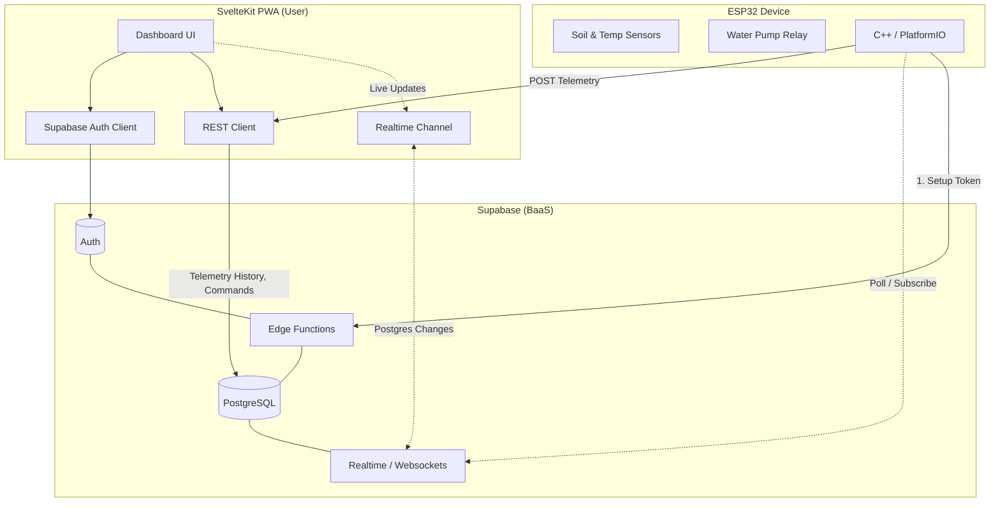
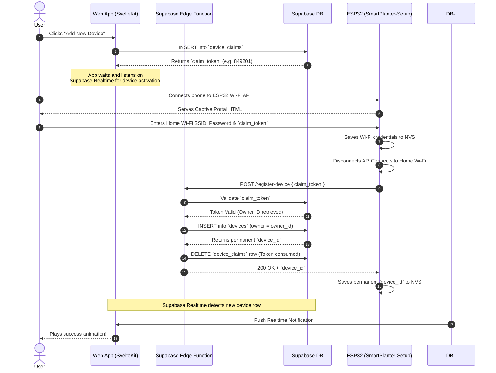

# System Architecture: Smart IoT Water System

This document outlines the high-level architecture, component topology, and critical user flows of the Smart IoT Watering System. The system comprises a physical ESP32 device, a Supabase Backend-as-a-Service (BaaS) layer, and a Progressive Web App (PWA) built with SvelteKit.

---

## 1. High-Level Component Topology

The system uses a pure serverless/BaaS architecture. Supabase acts as the central source of truth, routing both historical telemetry data via PostgreSQL and real-time commands via its Websockets/Realtime engine. This eliminates the need for an intermediate API layer or a dedicated MQTT broker, significantly reducing moving parts and hosting costs.

---

## 2. Device Provisioning Flow (Captive Portal)

To securely link a headless ESP32 device to an authenticated user's account without hardcoding credentials or requiring a native mobile app (Bluetooth/BLE), the system implements a **Captive Portal** token exchange mechanism.

---

## 3. Telemetry & Hardware Control Loop

During normal operation, the ESP32 operates autonomously. It pushes sensor readings periodically and polls/listens for manual override commands ("Water Plant" button) initialized by the user in the Web App.

```mermaid
sequenceDiagram
    actor User
    participant App as SvelteKit UI
    participant DB as Postgres (Supabase)
    participant RT as Realtime (Supabase)
    participant ESP32 as ESP32 Firmware
    participant Pump as Physical Pump

    %% Telemetry Flow
    rect rgb(23, 36, 27)
        Note right of ESP32: Standard Telemetry Loop (e.g., Every 30m)
        ESP32->>DB: POST /rest/v1/telemetry (moisture, temp)
        DB-->>RT: Trigger Insert Event
        RT-.->>App: Update Dashboard Chart Immediately
    end

    %% Command Flow
    rect rgb(47, 92, 67)
        Note left of User: Manual Override Loop
        User->>App: Press & Hold "Water Plant"
        App->>DB: INSERT command `pump_on` (Status: pending)
        DB-->>RT: Trigger Insert Event
        RT-.->>ESP32: Receives `pump_on` command
        ESP32->>Pump: GPIO HIGH (Start Pump)
        ESP32->>DB: UPDATE command set Status: `delivered`
        
        User->>App: Releases "Water Plant"
        App->>DB: INSERT command `pump_off` (Status: pending)
        DB-->>RT: Trigger Insert Event
        RT-.->>ESP32: Receives `pump_off` command
        ESP32->>Pump: GPIO LOW (Stop Pump)
        ESP32->>DB: UPDATE command set Status: `completed`
    end

    %% Automatic Fail-safe
    rect rgb(35, 30, 20)
        Note right of ESP32: Hardware Failsafe
        ESP32->>ESP32: If running > `pump_duration_seconds` limit?
        ESP32->>Pump: GPIO LOW (Stop Pump)
        ESP32->>DB: POST new System Event (Failsafe triggered)
    end
```

---

## 4. Key Architectural Decisions

1. **SvelteKit Serverless Deployment**: Deploys natively to Vercel. `+page.server.ts` resolves the bulky history queries prior to render, improving load times. Live telemetry binds client-side via `onMount` WebSockets.
2. **Compound B-Tree Indexing**: The `telemetry` table utilizes a structured index `(device_id, recorded_at desc)`. As the IoT database swells to millions of rows, the UI's `GET most recent 48 rows for device` query takes sub-millisecond I/O time.
3. **Data Type Memory Saving**: Sensor metrics utilize `real` float columns over `numeric`, cutting overall table disk storage by 50%.
4. **State Machine over Booleans**: Device commands utilize a Postgres ENUM (`pending`, `delivered`, `completed`, `failed`). This resolves the common IoT edge case where an app assumes a device received a command, but the device actually dropped offline during transit. The UI will visually reflect the pipeline state.
